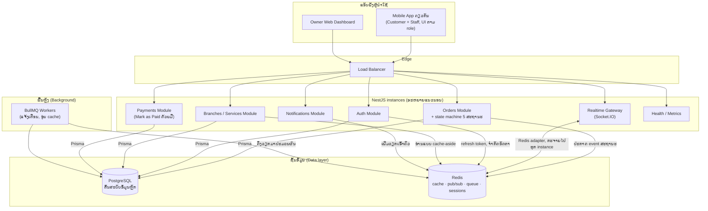
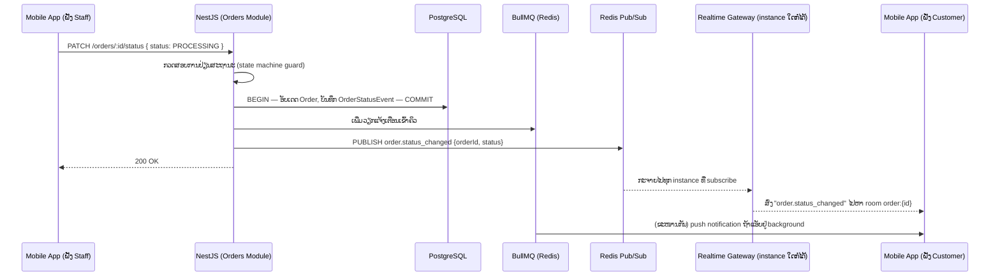
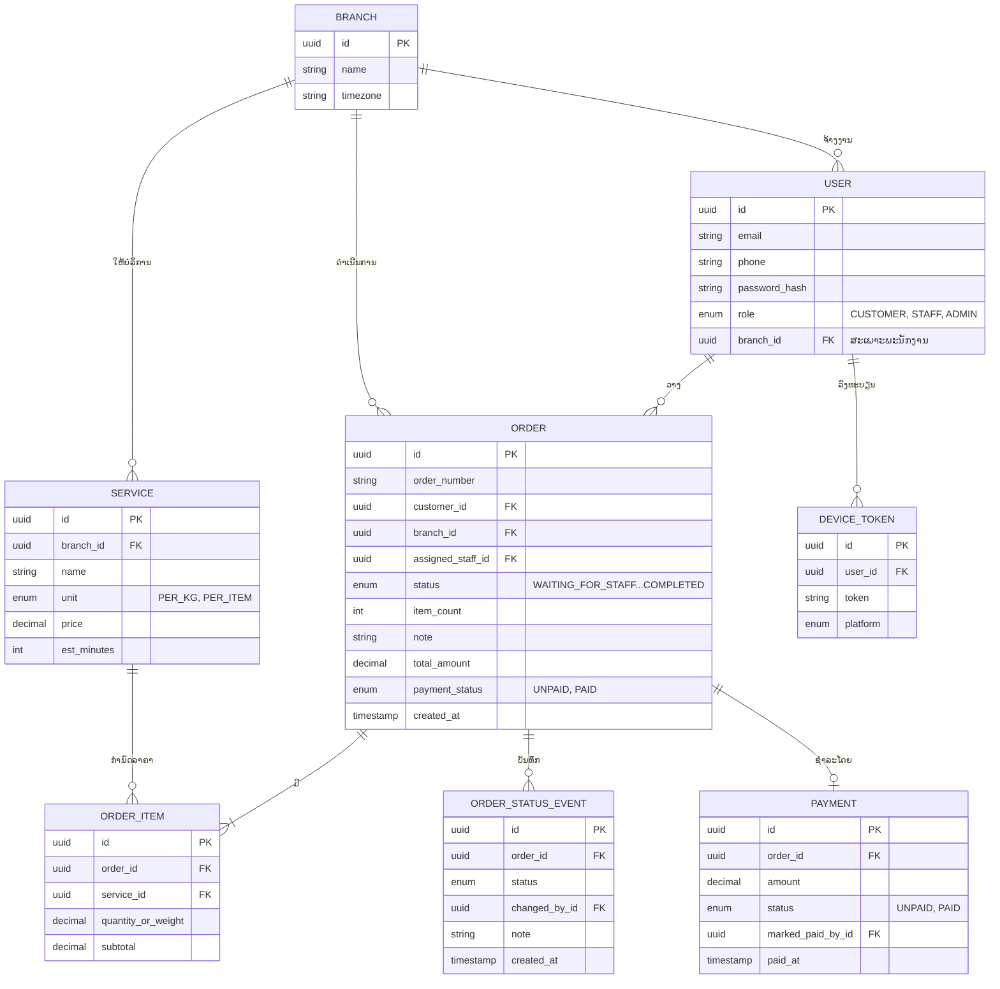

# Backend ຕິດຕາມການຊັກຜ້າແບບ Real-Time

> ເອກະສານໂຄງສ້າງລະບົບ · ARCH-001-LO · ກຽມ 2026-09-08 · ສະຖານະ: ຮ່າງ — ລໍຖ້າກວດສອບ
> Stack: **NestJS 11** · **Prisma ORM** · **PostgreSQL 16** · **Redis 7** · **Socket.IO** · **BullMQ**

ລະບົບຕິດຕາມສະຖານະການຊັກຜ້າແບບ real-time ສຳລັບຮ້ານທີ່ມີພະນັກງານໃຫ້ບໍລິການ — ລູກຄ້ານຳເອົາເສື້ອຜ້າມາຝາກ, ພະນັກງານດຳເນີນການຊັກ → ຫາງ → ພັບ, ແລະ ທຸກການປ່ຽນສະຖານະຈະໄປເຖິງແອັບຂອງລູກຄ້າໃນທັນທີ.

## ສາລະບານ

1. [ພາບລວມ ແລະ ຜູ້ນຳໃຊ້](#1-ພາບລວມ-ແລະ-ຜູ້ນຳໃຊ້)
2. [ໂຄງສ້າງອົງປະກອບ](#2-ໂຄງສ້າງອົງປະກອບ)
3. [ການໄຫຼວຽນຂໍ້ມູນ](#3-ການໄຫຼວຽນຂໍ້ມູນ--ການປ່ຽນສະຖານະແບບຄົບວົງຈອນ)
4. [ການອອກແບບ API](#4-ການອອກແບບ-api)
5. [ໂຄງສ້າງຖານຂໍ້ມູນ](#5-ໂຄງສ້າງຖານຂໍ້ມູນ)
6. [ຍຸດທະສາດການແຄຊ](#6-ຍຸດທະສາດການແຄຊ)
7. [ການພິສູດຢືນຢັນຕົວຕົນ ແລະ ການອະນຸຍາດ](#7-ການພິສູດຢືນຢັນຕົວຕົນ-ແລະ-ການອະນຸຍາດ)
8. [ການຕິດຕາມກວດສອບ](#8-ການຕິດຕາມກວດສອບ)
9. [ຄວາມປອດໄພ](#9-ຄວາມປອດໄພ)
10. [ແຜນການຈັດຕັ້ງປະຕິບັດ](#10-ແຜນການຈັດຕັ້ງປະຕິບັດ)
11. [ທາງເລືອກເທັກໂນໂລຊີ](#11-ທາງເລືອກເທັກໂນໂລຊີ)
12. [ທັກສະ Agent ສຳລັບ Stack ນີ້](#12-ທັກສະ-agent-ສຳລັບ-stack-ນີ້)

---

## 1. ພາບລວມ ແລະ ຜູ້ນຳໃຊ້

ນີ້ແມ່ນຮູບແບບ "ບໍລິການເຕັມຮູບແບບ" ບໍ່ແມ່ນ self-service — ລູກຄ້າມອບເສື້ອຜ້າໃຫ້ ແລະ ບໍ່ໄດ້ແຕະຕ້ອງເຄື່ອງຈັກເລີຍ. ໜ້າທີ່ຂອງລະບົບແມ່ນເຮັດໃຫ້ການມອບໝາຍນີ້ໜ້າເຊື່ອຖື — ລູກຄ້າທຸກຄົນເຫັນຢ່າງແນ່ນອນວ່າຄໍາສັ່ງຊື້ຂອງເຂົາເຈົ້າຢູ່ໃສ, ແບບ real-time, ໂດຍບໍ່ຕ້ອງໂທຫາຮ້ານ.

| Role | ໜ້າວຽກ |
|---|---|
| **CUSTOMER** (ລູກຄ້າ) | ສ້າງຄໍາສັ່ງຊື້ຜ່ານແອັບ, ເບິ່ງສະຖານະ ແລະ ໄທມ໌ໄລນ໌ແບບ real-time, ເບິ່ງລາຄາ ແລະ ສະຖານະການຈ່າຍເງິນ, ຮັບ push notification |
| **STAFF** (ພະນັກງານ) | ໃຊ້ Mobile App ດຽວກັນກັບລູກຄ້າ (UI/ສິດຕ່າງກັນຕາມ role) — ຮັບ order, ອັບເດດສະຖານະ (ບໍ່ບັງຄັບອັບເດດແຕ່ລະຂັ້ນຕອນຍ່ອຍ), ໝາຍການຈ່າຍເງິນວ່າ Paid, ຄົ້ນຫາ order ຈາກ ID/ຊື່/ເບີໂທ |
| **OWNER / ADMIN** (ເຈົ້າຂອງຮ້ານ) | ໃຊ້ Web Dashboard ແຍກຕ່າງຫາກ — ເບິ່ງ order, ລູກຄ້າ, ພະນັກງານ, ສະຖານະ order, ສະຖານະການຈ່າຍເງິນ, ຂໍ້ມູນພື້ນຖານຂອງຮ້ານ, ລາຍງານພື້ນຖານ |

> Phase 1 ບໍ່ມີ role **DRIVER** ຫຼື **MANAGER** — ບໍ່ມີ pickup/delivery ໃນ MVP ນີ້ (ຍົກໄປ Phase 2), ແລະ ໜ້າທີ່ບໍລິຫານໃຊ້ ADMIN/OWNER ຄົນດຽວກັບ Web Dashboard.

## 2. ໂຄງສ້າງອົງປະກອບ

Modular monolith ໃນ NestJS: ໜຶ່ງ deployable, ຂອບເຂດ module ທີ່ເຄັ່ງຄັດ, ດັ່ງນັ້ນສ່ວນຕ່າງໆ (ເຊັ່ນ Payments, Realtime) ຈຶ່ງແຍກອອກເປັນ service ຕ່າງຫາກພາຍຫຼັງໄດ້ ໂດຍບໍ່ຕ້ອງຂຽນໃໝ່ທັງໝົດ.



> Object storage (ຮູບຫຼັກຖານເສື້ອຜ້າ) ຖືກຕັດອອກຈາກ Phase 1 — PDF ຈັດ "Photo Before Washing / Damage Evidence" ໄວ້ໃນ Phase 2.

| Module | ຮັບຜິດຊອບ |
|---|---|
| `AuthModule` | ເຂົ້າສູ່ລະບົບ, ໝູນວຽນ refresh token, guards, RBAC, OTP ທາງໂທລະສັບ (ທາງເລືອກ) |
| `UsersModule` | ໂປຣໄຟລ໌ລູກຄ້າ ແລະ ພະນັກງານ, device token |
| `BranchesModule` | ສະຖານທີ່ຮ້ານ, ເວລາເປີດ-ປິດ, ຄວາມສາມາດຮັບອໍເດີ |
| `ServicesModule` | ບັນຊີລາຄາ — ຊັກ/ຫາງ/ອັດ, ຄິດເປັນກິໂລ ຫຼື ຕໍ່ຕົວ |
| `OrdersModule` | ວົງຈອນຊີວິດຄໍາສັ່ງຊື້, state machine 5 ສະຖານະ (`WAITING_FOR_STAFF → ORDER_ACCEPTED → PROCESSING → READY → COMPLETED`), ປະຫວັດສະຖານະ (ຕົ້ນສະບັບຄວາມຈິງ) |
| `RealtimeModule` | Socket.IO gateway, ການເຂົ້າຮ່ວມ room, ການເຊື່ອມຕໍ່ Redis adapter |
| `PaymentsModule` | ໝາຍສະຖານະ `UNPAID → PAID` ດ້ວຍມືໂດຍພະນັກງານ ຫຼັງລູກຄ້າຈ່າຍທີ່ຮ້ານ (Pay at Shop) — ບໍ່ມີ payment gateway/webhook ໃນ Phase 1 |
| `NotificationsModule` | ສົ່ງແຈ້ງເຕືອນ push / SMS / email ຜ່ານ BullMQ producer |
| `PrismaModule` / `RedisModule` | client ແບບ global, injectable — ໜຶ່ງ connection pool ຕໍ່ instance |
| `HealthModule` | liveness/readiness probe, endpoint metrics ຂອງ Prometheus |

## 3. ການໄຫຼວຽນຂໍ້ມູນ — ການປ່ຽນສະຖານະແບບຄົບວົງຈອນ

ຈຸດທີ່ຕ້ອງໃຫ້ຄວາມຮູ້ສຶກວ່າໄວທັນທີ: ພະນັກງານສະແກນຄໍາສັ່ງຊື້ໃຫ້ກ້າວໜ້າໜຶ່ງຂັ້ນ ແລ້ວແອັບຂອງລູກຄ້າອັບເດດເອງໂດຍບໍ່ຕ້ອງ refresh.



> ການສົ່ງຜ່ານ Redis pub/sub ນີ້ແມ່ນສິ່ງທີ່ເຮັດໃຫ້ລະບົບເຮັດວຽກໄດ້ໃນຫຼາຍ instance ຂອງ NestJS: instance ທີ່ຖື socket ຂອງລູກຄ້າ ບໍ່ຈຳເປັນຕ້ອງເປັນ instance ດຽວກັນກັບທີ່ຮັບ API request.

## 4. ການອອກແບບ API

REST ສຳລັບຄຳສັ່ງ ແລະ ການອ່ານຂໍ້ມູນ, ມີເວີຊັນຢູ່ພາຍໃຕ້ `/api/v1`; ໜຶ່ງ Socket.IO namespace ສຳລັບທຸກຢ່າງທີ່ຕ້ອງມາເຖິງໂດຍບໍ່ໄດ້ຮ້ອງຂໍ.

| Endpoint | ໃຜ | ຈຸດປະສົງ |
|---|---|---|
| `POST /auth/login` | ທຸກຄົນ | ເຂົ້າສູ່ລະບົບດ້ວຍລະຫັດຜ່ານ ຫຼື OTP, ອອກ access + refresh token |
| `POST /auth/refresh` | ທຸກຄົນ | ໝູນວຽນ refresh token (ເກັບໄວ້ໃນ Redis, ຍົກເລີກໄດ້ທັນທີ) |
| `GET /branches/:id/services` | ທຸກຄົນ | ບັນຊີລາຄາແບບສົດຂອງສາຂາ (cache ໄວ້) |
| `POST /orders` | ລູກຄ້າ, ພະນັກງານ | ສ້າງຄໍາສັ່ງຊື້ — ຈອງຜ່ານແອັບ ຫຼື ພະນັກງານປ້ອນລູກຄ້າ walk-in |
| `GET /orders` | ເຈົ້າຂອງ, ພະນັກງານ | ລາຍການ order ທັງໝົດ, filter ຕາມ status/customer/ວັນທີ — ໃຊ້ໂດຍ Staff (order ໃໝ່) ແລະ Owner Web Dashboard (ລາຍການ order) |
| `GET /orders/:id` | ເຈົ້າຂອງ, ພະນັກງານ | ລາຍລະອຽດຄໍາສັ່ງຊື້ + ສະຖານະປັດຈຸບັນ |
| `GET /orders/:id/history` | ເຈົ້າຂອງ, ພະນັກງານ | ໄທມ໌ໄລນ໌ສະຖານະທັງໝົດ, ຈາກ `OrderStatusEvent` |
| `PATCH /orders/:id/status` | ພະນັກງານ | ເລື່ອນ state machine ໄປໜຶ່ງການປ່ຽນທີ່ຖືກຕ້ອງ (5 ສະຖານະ) |
| `PATCH /orders/:id/payment` | ພະນັກງານ | ໝາຍສະຖານະການຈ່າຍເງິນເປັນ `PAID` ຫຼັງລູກຄ້າຈ່າຍທີ່ຮ້ານ (Mark as Paid) — ບໍ່ມີ payment gateway ໃນ Phase 1 |
| `GET /users?role=` | ເຈົ້າຂອງ (ADMIN) | ລາຍຊື່ລູກຄ້າ ຫຼື ພະນັກງານ (filter ຕາມ role) — ໃຊ້ໂດຍ Owner Web Dashboard ໜ້າ "ລູກຄ້າ" ແລະ "ພະນັກງານ", ອ່ານຢ່າງດຽວໃນ Phase 1 (ບໍ່ມີ create/delete staff ຜ່ານ endpoint ນີ້ — ເບິ່ງໝາຍເຫດລຸ່ມ) |
| `WS /realtime` | ລູກຄ້າ, ພະນັກງານ | Room: `customer:{id}`, `branch:{id}:staff` |
| `GET /health` · `/metrics` | ຝ່າຍປະຕິບັດງານ | liveness/readiness, ຈຸດໃຫ້ Prometheus scrape |

> ໝາຍເຫດ: PDF Requirement (§2.3) ລະບຸໃຫ້ Owner "ดู Staff" ເທົ່ານັ້ນ, ບໍ່ໄດ້ລະບຸໃຫ້ Owner ສ້າງບັນຊີພະນັກງານເອງຜ່ານ UI — ໃນ Phase 1 ບັນຊີພະນັກງານໃໝ່ຖືກສ້າງໂດຍກົງໃນຖານຂໍ້ມູນ (seed/support ໂດຍຜູ້ພັດທະນາ), ບໍ່ແມ່ນ self-service ຜ່ານ Dashboard — ຖ້າລູກຄ້າຕ້ອງການສ້າງ/ລຶບພະນັກງານເອງຜ່ານ UI, ນີ້ຄື Change Request ແຍກຕ່າງຫາກ (ຕ້ອງການ `POST/DELETE /users` ເພີ່ມ)

### ສະຖານະຄໍາສັ່ງຊື້ — State Machine

ບັງຄັບໃຊ້ຢູ່ຝັ່ງ server ບ່ອນດຽວ; API ຈະປະຕິເສດການປ່ຽນສະຖານະໃດໆທີ່ບໍ່ຢູ່ໃນລຳດັບນີ້.

```
WAITING_FOR_STAFF → ORDER_ACCEPTED → PROCESSING → READY → COMPLETED

(ຈາກສະຖານະໃດນຶ່ງກ່ອນ PROCESSING) → CANCELLED
```

> Washing / Drying / Ironing / Folding ແມ່ນລາຍລະອຽດພາຍໃນ `PROCESSING` ເທົ່ານັ້ນ — Phase 1 ບໍ່ບັງຄັບໃຫ້ Staff ອັບເດດແຕ່ລະຂັ້ນຕອນຍ່ອຍ, ເພື່ອຫຼຸດຈຳນວນ action ຂອງ Staff (ຕາມ MVP requirement §19). ການແຍກສະຖານະລະອຽດກວ່ານີ້, ພ້ອມ pickup/delivery, ໄວ້ພິຈາລະນາໃນ Phase 2.

## 5. ໂຄງສ້າງຖານຂໍ້ມູນ

`OrderStatusEvent` ເປັນແບບ append-only ແລະ ເປັນຕົ້ນສະບັບຄວາມຈິງທີ່ແທ້ຈິງ — `Order.status` ເປັນ "ຄ່າປັດຈຸບັນ" ແບບ denormalized ທີ່ຖືກຮັກສາໃຫ້ກົງກັນພາຍໃນ transaction ດຽວກັນ, ດັ່ງນັ້ນສະຖານະສົດ ແລະ ບັນທຶກກວດສອບຈຶ່ງບໍ່ມີວັນຂັດແຍ່ງກັນ.



### ໝາຍເຫດເລື່ອງ Index

- `Order(branch_id, status, created_at)` — query ຫຼັກຂອງ dashboard ສາຂາ, "ຕອນນີ້ມີຫຍັງແດ່ທີ່ກຳລັງດຳເນີນການຢູ່"
- `Order(customer_id, created_at desc)` — ປະຫວັດຄໍາສັ່ງຊື້ຂອງລູກຄ້າ
- `OrderStatusEvent(order_id, created_at)` — ການອ່ານ timeline, ຮຽງລຳດັບສະເໝີ
- `Order.order_number` unique — ເລກທີ່ອ່ານໄດ້, ພິມຢູ່ປ້າຍເສື້ອຜ້າ (claim tag)

> **ໝາຍເຫດ:** scaffold ປັດຈຸບັນຕັ້ງຄ່າ Prisma ດ້ວຍ `@prisma/adapter-better-sqlite3` — ໃຫ້ປ່ຽນ provider ຂອງ datasource ເປັນ `postgresql` ແລະ ປ່ຽນມາໃຊ້ `@prisma/adapter-pg` ກ່ອນສ້າງ migration ທຳອິດ.

## 6. ຍຸດທະສາດການແຄຊ

Redis ຮັບຜິດຊອບ 4 ໜ້າວຽກທີ່ແຕກຕ່າງກັນຢູ່ນີ້ — ການປະປົນມັນເຂົ້າກັນເປັນ client/config ດຽວແມ່ນວິທີທົ່ວໄປທີ່ສຸດທີ່ລະບົບແບບນີ້ຈະຍາກຕໍ່ການເຂົ້າໃຈໃນພາຍຫຼັງ, ດັ່ງນັ້ນແຕ່ລະໜ້າວຽກຈຶ່ງໄດ້ key namespace ຂອງຕົນເອງ.

| ການໃຊ້ງານ | ຮູບແບບ | ຮູບແບບ Key |
|---|---|---|
| Read-through cache | Cache-aside, TTL 5–15 ນາທີ, ລຶບ cache ທັນທີເມື່ອຂຽນ | `branch:{id}:services` |
| Session / refresh token | TTL = ອາຍຸ token; ລຶບເມື່ອ logout ເພື່ອຍົກເລີກທັນທີ | `session:refresh:{jti}` |
| Realtime fan-out | Pub/sub ຮອງຮັບ Socket.IO Redis adapter ຂ້າມ instance | `socket.io#order.status_changed` |
| Job queue | BullMQ — ແຈ້ງເຕືອນ push, ອຸ່ນ cache ຕາມກຳນົດເວລາ | `bull:notifications:*` |
| Rate limiting | ຕົວນັບແບບ sliding window ຢູ່ຫຼັງ `@nestjs/throttler` | `throttle:{ip\|userId}:{route}` |
| Distributed lock | Redlock — ປ້ອງກັນການສ້າງເລກຄໍາສັ່ງຊື້ພ້ອມກັນ | `lock:order-number:{branchId}` |

## 7. ການພິສູດຢືນຢັນຕົວຕົນ ແລະ ການອະນຸຍາດ

**Token**
- JWT access token ອາຍຸສັ້ນ (~15 ນາທີ), Passport `JwtStrategy`
- Refresh token ໝູນວຽນ, hash ໄວ້ໃນ Redis ດ້ວຍ TTL ທີ່ກົງກັນ
- Password hash ດ້ວຍ `argon2`, ບໍ່ແມ່ນ bcrypt
- ທາງເລືອກ: ເຂົ້າສູ່ລະບົບດ້ວຍ OTP ທາງໂທລະສັບສຳລັບລູກຄ້າ

**ການອະນຸຍາດ (Authorization)**
- Decorator `@Roles()` + `RolesGuard`: CUSTOMER, STAFF, ADMIN
- Endpoint ຂອງພະນັກງານຖືກຈຳກັດເພີ່ມຕາມ `branch_id` ຂອງຕົນເອງ
- WebSocket handshake ຖື JWT ດຽວກັນ; gateway ກວດສອບກ່ອນເຂົ້າຮ່ວມ room
- Socket ເຂົ້າຮ່ວມພຽງ 2 room: `customer:{id}` ຂອງຕົນເອງ ຫຼື staff room ຂອງສາຂາຕົນເອງ

## 8. ການຕິດຕາມກວດສອບ

- **Logs** — `nestjs-pino`, JSON ແບບມີໂຄງສ້າງ, correlation ID ຕໍ່ request, ສົ່ງໄປ Loki ຫຼື CloudWatch
- **Metrics** — `@willsoto/nestjs-prometheus` — latency ຂອງ request, ຄວາມເລິກຄິວ, ອັດຕາ cache hit, ຈຳນວນການເຊື່ອມຕໍ່ socket
- **Traces ແລະ Errors** — OpenTelemetry ຂ້າມ API → Prisma → Redis; Sentry ສຳລັບ exception ພ້ອມ context ຂອງ request

> Health check ຜ່ານ `@nestjs/terminus` ກວດ Postgres, Redis, ແລະ disk — ເຊື່ອມກັບ readiness probe ຂອງ load balancer ດັ່ງນັ້ນ instance ທີ່ເສຍຈະຖືກດຶງອອກຈາກ rotation, ບໍ່ແມ່ນພຽງແຕ່ log ໄວ້.

## 9. ຄວາມປອດໄພ

- ValidationPipe ແບບ global ດ້ວຍ `whitelist` + `forbidNonWhitelisted` — ບໍ່ມີຟິວທີ່ບໍ່ໄດ້ປະກາດເຂົ້າມາເຖິງ handler
- Parameterized query ຂອງ Prisma ປິດຊ່ອງ SQL injection; `$queryRawUnsafe` ຖືກຫ້າມດ້ວຍ lint rule, ບໍ່ແມ່ນພຽງແຕ່ຄຳແນະນຳ
- Helmet + CORS allowlist ທີ່ເຄັ່ງຄັດຕໍ່ environment; HTTPS/HSTS ທຸກບ່ອນ
- Idempotency key ຢູ່ endpoint ສ້າງຄໍາສັ່ງຊື້ — request ທີ່ສົ່ງຊ້ຳຈະບໍ່ສາມາດຈອງຊ້ຳໄດ້ (ບໍ່ມີຄວາມສ່ຽງເກັບເງິນຊ້ຳ ເພາະ Phase 1 ຈ່າຍທີ່ຮ້ານ, ບໍ່ມີ payment gateway)
- Role ແລະ permission ຂອງ Mobile App (Customer/Staff) ຖືກກຳນົດຈາກ backend ເທົ່ານັ້ນ — ຫ້າມ hardcode ເງື່ອນໄຂຢູ່ client (ເຊັ່ນ ກວດ phone number) ຕາມ anti-pattern ທີ່ PDF ລະບຸໄວ້
- Secret ຢູ່ນອກ repo (gitignore ໄວ້ແລ້ວ) — ໃຊ້ secrets manager ແທ້ໆໃນ staging/production, ບໍ່ແມ່ນໄຟລ໌ `.env`
- ຊື່ ແລະ ເບີໂທຂອງລູກຄ້າແມ່ນຂໍ້ມູນສ່ວນຕົວ — ເຂົ້າລະຫັດຂໍ້ມູນຕອນເກັບ ແລະ ຈຳກັດການເຂົ້າເຖິງຕາມ role ຖ້າກົດໝາຍປົກປ້ອງຂໍ້ມູນທ້ອງຖິ່ນ (ເຊັ່ນ PDPA) ນຳໃຊ້
- `OrderStatusEvent` ເຮັດໜ້າທີ່ເປັນ audit log ນຳ; ການກະທຳສຳຄັນຂອງ admin (ຄືນເງິນ, ປ່ຽນສະຖານະດ້ວຍມື) ຄວນມີ audit trail ຂອງຕົນເອງ

## 10. ແຜນການຈັດຕັ້ງປະຕິບັດ

ຈັດລຳດັບເພື່ອໃຫ້ແຕ່ລະໄລຍະຖິ້ມສິ່ງທີ່ສາທິດໄດ້ຈິງໄວ້ — ບໍ່ແມ່ນ abstraction ເຮັດຄ້າງໄວ້ລໍຖ້າໄລຍະຕໍ່ໄປ.

| ໄລຍະ | ຫົວຂໍ້ | ລາຍລະອຽດ |
|---|---|---|
| 00 | ພື້ນຖານ | ຕັ້ງ Prisma ໃຫ້ຊີ້ໄປ PostgreSQL (ປ່ຽນຈາກ adapter sqlite), Docker Compose ສຳລັບ Postgres + Redis, ກວດສອບ env ດ້ວຍ zod, ໂຄງ CI ພື້ນຖານ |
| 01 | ຕົວຕົນ (Identity) | Users, roles, JWT auth + ໝູນວຽນ refresh token ໃນ Redis, guards — ພຽງພໍທີ່ຈະ login ເປັນລູກຄ້າ ແລະ ພະນັກງານໄດ້ |
| 02 | ໂດເມນຫຼັກ | Branches, Services, Orders, OrderItems, state machine 5 ສະຖານະ (`WAITING_FOR_STAFF → ORDER_ACCEPTED → PROCESSING → READY → COMPLETED`) ແລະ ບັນທຶກ `OrderStatusEvent` — ຍັງບໍ່ມີ realtime, REST ລ້ວນໆ |
| 03 | Realtime | Socket.IO gateway + Redis adapter; ເຊື່ອມການປ່ຽນສະຖານະໃຫ້ broadcast — ນີ້ຄືຄຸນສົມບັດທີ່ຜະລິດຕະພັນນີ້ຖືກຕັ້ງຊື່ຕາມ |
| 04 | ວຽກແບບ Async | BullMQ ສຳລັບແຈ້ງເຕືອນ push, ອຸ່ນ cache ຕາມກຳນົດເວລາ |
| 05 | ສະຖານະການຈ່າຍເງິນ | Endpoint `Mark as Paid` ດ້ວຍມືໂດຍພະນັກງານ (Pay at Shop) — ບໍ່ເຊື່ອມ payment gateway/webhook ໃນ Phase 1 |
| 06 | ການສັງເກດການ | Logging, metrics, tracing, health check, Sentry — ກ່ອນມີ load ຫຼາຍ, ບໍ່ແມ່ນຫຼັງເກີດເຫດການ |
| 07 | ເສີມຄວາມແຂງແຮງ ແລະ ຂະຫຍາຍ | Rate limiting, ທົດສອບ load ດ້ວຍ k6, read replica ຖ້າຕ້ອງການ, ຂະຫຍາຍ NestJS pool ແບບອັດຕະໂນມັດ |

> **Phase 2 (ນອກຂອບເຂດເອກະສານນີ້):** Driver App + Pickup/Delivery, ຮູບຫຼັກຖານກ່ອນຊັກ (Damage Evidence), ສະຖານະລະອຽດກວ່າ 5 ຂັ້ນ, Multi-branch, Loyalty/Promotion, Advanced Reports — ຕາມ PDF Requirement §22–23, ຄວນເລີ່ມພັດທະນາຫຼັງຈາກ Phase 1 ຖືກໃຊ້ງານຈິງ ແລະ ໄດ້ຮັບ feedback ຈາກລູກຄ້າແລ້ວ.
>
> **ບໍ່ຢູ່ໃນແຜນເລີຍ (ບໍ່ວາງແຜນເຮັດແມ່ນແຕ່ Phase 2):** Payment Gateway, Bank API, QR Payment — ໂຄງການນີ້ຈະໃຊ້ "ຈ່າຍທີ່ຮ້ານ" (UNPAID/PAID ດ້ວຍມືໂດຍພະນັກງານ) ຖາວອນ, ບໍ່ເຊື່ອມຕໍ່ຜູ້ໃຫ້ບໍລິການຈ່າຍເງິນອອນລາຍໃດໆ

## 11. ທາງເລືອກເທັກໂນໂລຊີ

| ດ້ານ | ທາງເລືອກ | ເຫດຜົນ |
|---|---|---|
| Framework | NestJS 11 | ກຳນົດມາແລ້ວ — DI ແບບ module ເໝາະກັບຂອບເຂດ module ຂ້າງເທິງ |
| ORM | Prisma, `@prisma/adapter-pg` | ກຳນົດມາແລ້ວ — migration ແບບ type-safe; ຕ້ອງປ່ຽນ datasource ຈາກ sqlite |
| Database | PostgreSQL 16 | ກຳນົດມາແລ້ວ — row-level locking ແລະ JSON column ຮອງຮັບ metadata ໂດຍບໍ່ຕ້ອງມີ store ທີ 2 |
| Cache / broker | Redis 7 | ກຳນົດມາແລ້ວ — engine ດຽວຮັບໃຊ້ cache, pub/sub, queue ແລະ rate-limit |
| Realtime transport | Socket.IO + `@socket.io/redis-adapter` | ມີ room ແລະ reconnection ພ້ອມໃຊ້; ຂະຫຍາຍຂ້າມ instance ຜ່ານ Redis |
| Job queue | BullMQ | ໃຊ້ Redis ໂດຍກົງ, ເຊື່ອມກັບ queue module ຂອງ NestJS ໂດຍກົງ |
| Auth | Passport-JWT + argon2 | ເສັ້ນທາງ auth ມາດຕະຖານຂອງ NestJS; argon2 ເປັນຄຳແນະນຳປັດຈຸບັນສຳລັບ hash password |
| Deployment | Docker → ECS/Fargate ຫຼື Kubernetes | API pod ແບບ stateless ຢູ່ຫຼັງ load balancer; Postgres/Redis ຈັດການແຍກຕ່າງຫາກ |

> File storage (S3-compatible) ຍັງບໍ່ຈຳເປັນໃນ Phase 1 ເນື່ອງຈາກບໍ່ມີຮູບຫຼັກຖານເສື້ອຜ້າ — ໃຫ້ເພີ່ມເຂົ້າມາຕອນເລີ່ມ Phase 2 (Photo Before Washing / Damage Evidence)

## 12. ທັກສະ Agent ສຳລັບ Stack ນີ້

ຈາກ [skillsmp.com](https://skillsmp.com) — ທັກສະທີ່ກົງກັບ stack ນີ້ (NestJS + Prisma + PostgreSQL + Redis) ທັງໝົດມາຈາກຜູ້ພັດທະນາຄົນດຽວ, `affaan-m/ECC`, ແລະ ອ່ານຄືເປັນຊຸດທີ່ເຂົ້າກັນ ບໍ່ແມ່ນວຽກແຍກແຕ່ລະຊິ້ນ.

| ທັກສະ | ຄອບຄຸມ | ຈຸດທີ່ຊ່ວຍໃນນີ້ |
|---|---|---|
| `nestjs-patterns` | Module, controller, DTO validation, guard, interceptor | ຮັກສາຂອບເຂດ module ໃນ §2 ໃຫ້ສອດຄ່ອງເມື່ອແອັບໃຫຍ່ຂຶ້ນ |
| `prisma-patterns` | ການອອກແບບ schema, ປັບປຸງ query, transaction, pagination | Transaction ຂອງ state machine ສະຖານະ ແລະ pagination ຂອງປະຫວັດຄໍາສັ່ງຊື້ |
| `postgres-patterns` | Index, ປັບ query, row-level security | Composite index ໃນ §5, ແລະ RLS ຖ້າຕ້ອງແຍກຂໍ້ມູນພະນັກງານ/ລູກຄ້າຢູ່ລະດັບ DB |
| `redis-patterns` | Data structure, caching, distributed lock, pub/sub, rate limiting | ກົງກັບທຸກແຖວຂອງຕາຕະລາງ §6 ໂດຍກົງ |
| `database-migrations` | ປ່ຽນ schema ແບບ zero-downtime, rollback | Migration ທີ່ປອດໄພເມື່ອຕາຕະລາງ order/payment ມີຂໍ້ມູນຈິງແລ້ວ |
| `documentation-lookup` | ດຶງເອກະສານ library ຫຼ້າສຸດຜ່ານ Context7 ແທນທີ່ຈະໃຊ້ training data | ເປັນປະໂຫຍດເນື່ອງຈາກ NestJS/Prisma ອອກເວີຊັນໃໝ່ໄວ |

> Code ຂອງທັກສະຖືກເຜີຍແຜ່ໂດຍຊຸມຊົນ — ຄວນອ່ານກ່ອນຕິດຕັ້ງ ຄືກັນກັບ dependency ອື່ນໆ.

---

*Backend ຕິດຕາມການຊັກຜ້າ — ເອກະສານໂຄງສ້າງລະບົບ · ກຽມສຳລັບການທົບທວນພາຍໃນ*
